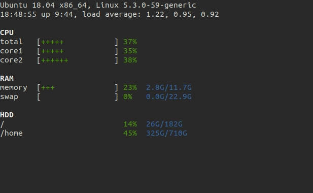

# qinfo

[](https://travis-ci.com/blues911/qinfo)


Displays system information based on Linux processes.

Available data:
- Distribution release
- Kernel version
- Uptime
- Load average
- CPU
- RAM
- HDD

Tested only on Debian/Ubuntu OS.



## Dependencies

```
procps
```

## Install

```
git clone https://github.com/blues911/qinfo.git
cd qinfo/
pip install .
```